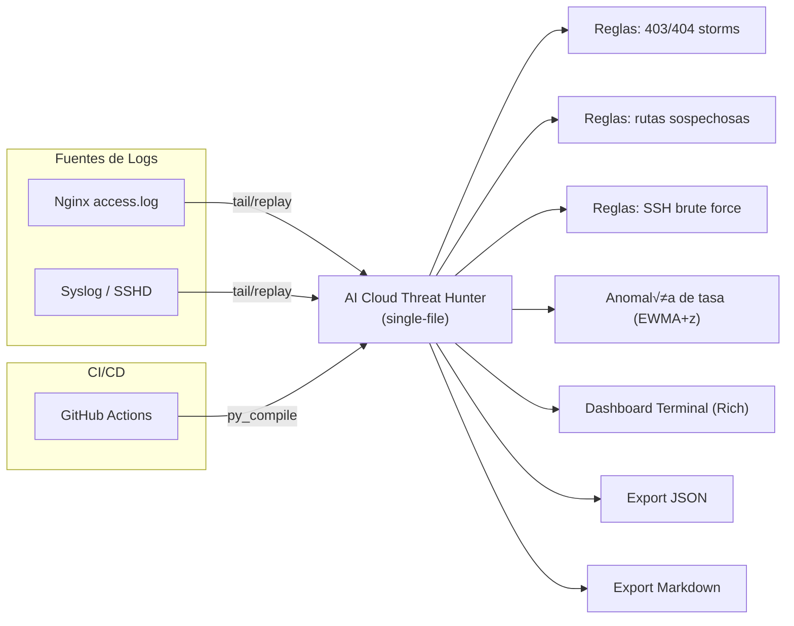

# 🛡️ AI Cloud Threat Hunter

> **Threat hunting** en tiempo real para **logs de Nginx** y **syslog/SSH**, con **detecciones por reglas**, **anomalías estadísticas (EWMA + z-score)**, dashboard en consola (**Rich**) y **reportes JSON/Markdown**. Pensado para **Codespaces**, **DevSecOps** y operatividad desde el día 1.

<p align="left">
  
  
  
  
</p>

---

## üìå Objetivos del proyecto

* **Operar en minutos:** script **single-file** listo para correr en **Codespaces**, VMs o servidores.
* **Detección inmediata:** reglas para **fuerza bruta SSH**, **tormentas 403/404** y **rutas sospechosas**.
* **Anomalías ligeras:** **EWMA + z-score** para detectar **picos de tasa** por IP sin dependencias pesadas.
* **Observabilidad mínima viable:** **dashboard en terminal** y **reportes exportables** para auditoría.

---

## 🧱 Arquitectura (visión general)


```mermaid
flowchart LR
  subgraph "Fuentes de Logs"
    N["Nginx access.log"]
    S["Syslog / SSHD"]
  end

  N -->|tail/replay| H["AI Cloud Threat Hunter<br/>(single-file)"]
  S -->|tail/replay| H

  H --> R1["Reglas: 403/404 storms"]
  H --> R2["Reglas: rutas sospechosas"]
  H --> R3["Reglas: SSH brute force"]
  H --> A1["Anomalía de tasa (EWMA+z)"]

  H --> D["Dashboard Terminal (Rich)"]
  H --> E1["Export JSON"]
  H --> E2["Export Markdown"]

  subgraph "CI/CD"
    GH["GitHub Actions"]
  end
  GH -->|py_compile| H
```

> **Nota:** Diseño con **dependencias mínimas** (solo `rich` es opcional). No hay salidas a red, ni GeoIP por defecto.

---

## 🧰 Tecnologías

* **Python 3.9+** (stdlib).
* **UI opcional:** [`rich`](https://pypi.org/project/rich/) para tablas/paneles.
* **CI/CD:** GitHub Actions con compilación (`python -m py_compile`) → **ticket verde**.
* **Entornos:** GitHub Codespaces, Linux, macOS.

---

## 📂 Estructura del repositorio

```
.
├─ ai_cloud_threat_hunter.py     # Script único (core)
├─ sample_access.log             # Log de ejemplo (Nginx)
├─ report.md                     # Reporte (se genera al salir con Ctrl+C)
├─ requirements.txt              # Opcional: rich
└─ .github/workflows/ci.yml      # CI: compile check
```

> Minimalista y mantenible. El valor est√° en el **single-file**.

---

## ⚙️ Instalación y ejecución

### 1) Local / Codespaces

```bash
# (opcional) UI bonita
pip install -r requirements.txt  # o: pip install rich

# Nginx (demo con replay)
python ai_cloud_threat_hunter.py --log sample_access.log --format nginx --replay --speed 30 --threshold 2 --export-md report.md

# Syslog / SSH (detección fuerza bruta)
python ai_cloud_threat_hunter.py --log /var/log/syslog --format syslog --window 300 --threshold 5 --export-json report.json
```

**Atajos √∫tiles**

* `--replay` reproduce desde el inicio y luego **sigue** esperando nuevas líneas.
* `--threshold` b√°jalo para ver alertas m√°s r√°pido en demo.
* `--export-md` / `--export-json` generan informes periódicos y al salir (**Ctrl+C**).

---

## üîé Detecciones incluidas

* **Brute force SSH (syslog):** secuencia de `Failed password` desde la misma IP en la ventana `--window`.
* **Tormentas 404/403 (Nginx):** r√°fagas por IP ‚Üí `404_storm` / `403_storm`.
* **Rutas sospechosas:** `/wp-login.php`, `/admin`, `/.env`, `/phpmyadmin`, etc.
* **Anomalía de tasa (EWMA+z):** desviación significativa del ritmo esperado de solicitudes por IP.

> Umbrales/ventanas configurables con `--threshold` y `--window`.

---

## 🖥️ Dashboard y reportes

* **Dashboard en terminal (Rich):** métricas (Lines, Events, Alerts, Top IPs) + tabla de **últimas alertas**.
* **Reportes:**

  * **Markdown (`.md`)** legible para auditoría.
  * **JSON** para integraciones/pipelines.

**Ejemplo “all-in”:**

```bash
python ai_cloud_threat_hunter.py \
  --log sample_access.log --format nginx \
  --replay --speed 30 --threshold 2 \
  --export-json report.json --export-md report.md
```

---

## üß™ Smoke tests (r√°pidos)

```bash
# 1) Compilación (sintaxis OK)
python -m py_compile ai_cloud_threat_hunter.py

# 2) Demo Nginx (alertas inmediatas)
python ai_cloud_threat_hunter.py --log sample_access.log --format nginx --replay --speed 30 --threshold 2 --export-md report.md

# 3) Generar tr√°fico (otra terminal)
for i in $(seq 1 15); do
  echo '127.0.0.1 - - [21/Sep/2025:10:13:'$(printf "%02d" $i)' +0000] "GET /admin HTTP/1.1" 403 123 "-" "curl/7.68.0"' >> sample_access.log
  sleep 0.2
done
```

> Detén con **Ctrl+C** para volcar el **reporte final**.

---

## üîß Par√°metros principales

| Flag             | Descripción                                  | Default |
| ---------------- | -------------------------------------------- | ------- |
| `--log`          | Ruta del archivo de log                      | (req.)  |
| `--format`       | `auto` \| `nginx` \| `syslog`                | `auto`  |
| `--window`       | Ventana móvil (seg.) para detecciones        | `300`   |
| `--threshold`    | Umbral para storms / brute force / anomalías | `5`     |
| `--ewma-alpha`   | Suavizado del modelo de tasa                 | `0.3`   |
| `--replay`       | Reproducir desde el inicio                   | `false` |
| `--speed`        | Líneas/segundo en `--replay`                 | `25`    |
| `--export-md`    | Ruta de salida Markdown                      | `None`  |
| `--export-json`  | Ruta de salida JSON                          | `None`  |
| `--export-every` | Intervalo de export (s)                      | `30`    |
| `--refresh`      | Frecuencia de refresco del dashboard (s)     | `1.0`   |

---

## 📈 Observabilidad mínima

* **Top IPs por eventos.**
* **√öltimas alertas** con **severidad**, **tipo**, **detalle** y **score**.
* **Historial** exportado en Markdown/JSON.

---

## üö¢ CI/CD (GitHub Actions)

Pipeline en `.github/workflows/ci.yml`:

1. **Checkout**
2. **Setup Python**
3. **Compile check** ‚Üí `python -m py_compile ai_cloud_threat_hunter.py`

> Resultado: **ticket verde** al validar que el script compila.

---

## 🛡️ Buenas prácticas y seguridad

* Ejecutar con **permisos mínimos** (solo lectura del log).
* **No** subir secretos; usar `.env.example` y secrets de GitHub.
* En producción: usuario sin privilegios, forward/rotación de logs, WAF/IPS complementarios.

---

## 🗺️ Roadmap

* [ ] Flag `--self-test` con datos sintéticos y validación automática.
* [ ] Modo **API/Web** opcional para exponer estado (Flask/FastAPI).
* [ ] Integración con SIEM (enriquecimiento offline).
* [ ] Persistencia en SQLite/Parquet opcional.
* [ ] Reglas configurables por YAML.

---

## 🤝 Contribución

1. Crea un branch desde `main`.
2. Añade pruebas o `sample_*` para reproducir escenarios.
3. Asegura **compile check** y estilo.
4. Abre PR con contexto y checklist.

---

## üìú Licencia

**MIT** — libre uso en proyectos personales y empresariales.


##  Autor

**© 2025 Emanuel**

* LinkedIn: [https://www.linkedin.com/in/emanuel-gonzalez-michea/](https://www.linkedin.com/in/emanuel-gonzalez-michea/)


